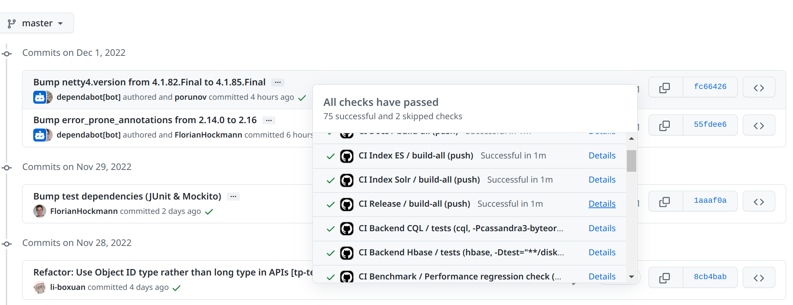
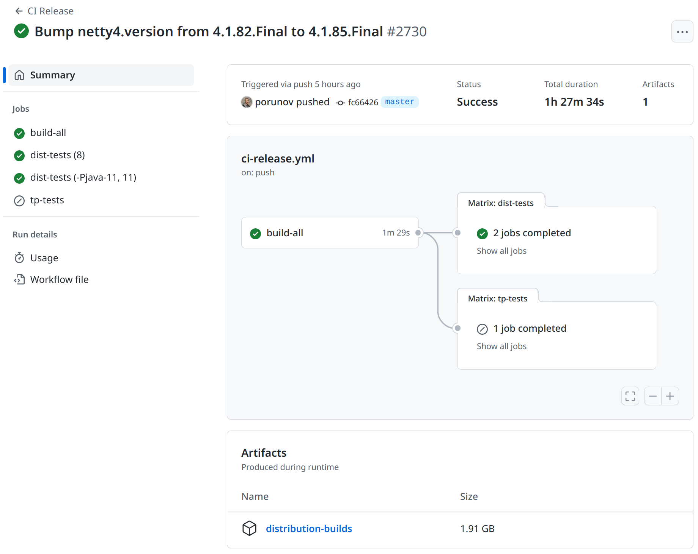
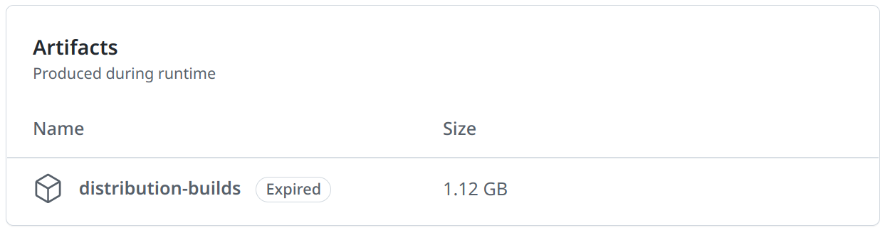

# Snapshot releases

In addition to official JanusGraph releases, JanusGraph publishes 
releases for each commit. The commit releases allow users to use latest
JanusGraph features without relying on official JanusGraph releases.

- Official JanusGraph releases are better tested and usually come with finalized
  changes which signals that the used features are most likely to be stable for long term.
- Commit releases are not manually verified but instead verified by main CI tests as
  well as scheduled full CI tests (once per week). New features in commit releases are not
  guaranteed to be compatible between commits. Thus, you may expect more breaking changes between
  commit releases and official releases.

## Maven repository artifacts

Both official and commit release are deployed to Sonatype OSS and are available in Sonatype Maven Central Repository 
under the same group id `org.janusgraph`, but with different artifact id format.  

Official JanusGraph releases have the next format for artifact id: `MAJOR.MINOR.PATCH`.  
Dependencies example:

/// tab | Maven
```xml
<dependency>
    <groupId>org.janusgraph</groupId>
    <artifactId>janusgraph-core</artifactId>
    <version>1.0.0</version>
</dependency>
```
///

/// tab | Gradle
```groovy
compile "org.janusgraph:janusgraph-core:1.0.0"
```
///

Artifact id for commit releases have the next format: `FOLLOWING_VERSION-DATE-TIME.COMMIT`.  

- `FOLLOWING_VERSION` is the upcoming official version to be used after release is finalized (i.e. `0.6.3` if the current latest release is `0.6.2`). 
It has `MAJOR.MINOR.PATCH` format.
- `DATE` - date of the commit release in `yyyyMMdd` format.
- `TIME` - time of the commit release in `HHmmss` format.
- `COMMIT` - short commit hash of the commit used in the release.

Dependencies example:

/// tab | Maven
```xml
<dependency>
    <groupId>org.janusgraph</groupId>
    <artifactId>janusgraph-core</artifactId>
    <version>0.6.3-20230104-164606.a49366e</version>
</dependency>
```
///

/// tab | Gradle
```groovy
compile "org.janusgraph:janusgraph-core:0.6.3-20230104-164606.a49366e"
```
///

## JanusGraph distribution builds

In addition to distribution builds provided for each official JanusGraph release, snapshot distribution builds are
provided for all commits.

!!! info
    GitHub allows to download distribution builds only for authenticated GitHub users.

To access the distribution build bundle for any commit, please open the commit you are interested in and select its
`CI Release` details. For example:


When `CI Release` page is opened for a specific commit, open summary and download the attached to `Artifacts` section
file named `distribution-builds`. This will download `distribution-builds.zip` archive containing all distribution builds.


!!! warning
    Old snapshot distribution builds are expiring in GitHub due to timing and memory limits. It's not guaranteed that
    the snapshot distribution build downloaded yesterday is available today. We encourage to use either official release
    distribution builds or newer snapshot distribution builds.

If you see expired distribution builds or don't see any distribution builds for a specific commit, it means that it isn't
available to be downloaded anymore. Thus, the distribution builds from newer commits should be used.

