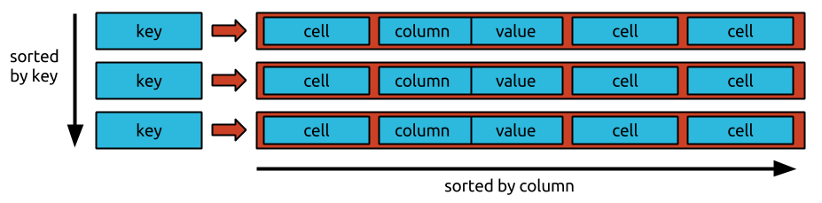
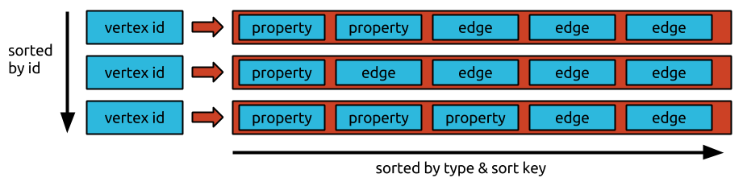

# JanusGraph Data Model

JanusGraph stores graphs in [adjacency list
format](https://en.wikipedia.org/wiki/Adjacency_list) which means that a
graph is stored as a collection of vertices with their adjacency list.
The adjacency list of a vertex contains all of the vertex’s incident
edges (and properties).

By storing a graph in adjacency list format JanusGraph ensures that all
of a vertex’s incident edges and properties are stored compactly in the
storage backend which speeds up traversals. The downside is that each
edge has to be stored twice - once for each end vertex of the edge.

In addition, JanusGraph maintains the adjacency list of each vertex in
sort order with the order being defined by the sort key and sort order
the edge labels. The sort order enables efficient retrievals of subsets
of the adjacency list using [vertex centric indices](../schema/index-management/index-performance.md#vertex-centric-indexes).

JanusGraph stores the adjacency list representation of a graph in any
[storage backend](../storage-backend/index.md) that supports the Bigtable data
model.

## Bigtable Data Model

Under the [Bigtable data model](https://en.wikipedia.org/wiki/Bigtable)
each table is a collection of rows. Each row is uniquely identified by a
key. Each row is comprised of an arbitrary (large, but limited) number
of cells. A cell is composed of a column and value. A cell is uniquely
identified by a column within a given row. Rows in the Bigtable model
are called "wide rows" because they support a large number of cells and
the columns of those cells don’t have to be defined up front as is
required in relational databases.

JanusGraph has an additional requirement for the Bigtable data model:
The cells must be sorted by their columns and a subset of the cells
specified by a column range must be efficiently retrievable (e.g. by
using index structures, skip lists, or binary search).

In addition, a particular Bigtable implementation may keep the rows
sorted in the order of their key. JanusGraph can exploit such key-order
to effectively partition the graph which provides better loading and
traversal performance for very large graphs. However, this is not a
requirement.

## JanusGraph Data Layout

JanusGraph stores each adjacency list as a row in the underlying storage
backend. The (64 bit) vertex id (which JanusGraph uniquely assigns to
every vertex) is the key which points to the row containing the vertex’s
adjacency list. Each edge and property is stored as an individual cell
in the row which allows for efficient insertions and deletions. The
maximum number of cells allowed per row in a particular storage backend
is therefore also the maximum degree of a vertex that JanusGraph can
support against this backend.

If the storage backend supports key-order, the adjacency lists will be
ordered by vertex id, and JanusGraph can assign vertex ids such that the
graph is effectively partitioned. Ids are assigned such that vertices
which are frequently co-accessed have ids with small absolute
difference.

## Individual Edge Layout

Each edge and property is stored as one cell in the rows of its adjacent
vertices. They are serialized such that the byte order of the column
respects the sort key of the edge label. Variable id encoding schemes
and compressed object serialization are used to keep the storage
footprint of each edge/cell as small as possible.

Consider the storage layout of an individual edge as visualized in the
top row of the graphic above. The dark blue boxes represent numbers that
are encoded with a variable length encoding scheme to reduce the number
of bytes they consume. Red boxes represent one or multiple property
values (i.e. objects) that are serialized with compressed meta data
referenced in the associated property key. Grey boxes represent
uncompressed property values (i.e. serialized objects).

The serialized representation of an edge starts with the edge label’s
unique id (as assigned by JanusGraph). This is typically a small number
and compressed well with variable id encoding. The last bit of this id
is offset to store whether this is an incoming or outgoing edge. Next,
the property value comprising the sort key are stored. The sort key is
defined with the edge label and hence the sort key objects meta data can
be referenced to the edge label. After that, the id of the adjacent
vertex is stored. JanusGraph does not store the actual vertex id but the
difference to the id of the vertex that owns this adjacency list. It is
likely that the difference is a smaller number than the absolute id and
hence compresses better. The vertex id is followed by the id of this
edge. Each edge is assigned a unique id by JanusGraph. This concludes
the column value of the edge’s cell. The value of the edge’s cell
contains the compressed serialization of the signature properties of the
edge (as defined by the label’s signature key) and any other properties
that have been added to the edge in uncompressed serialization.

The serialized representation of a property is simpler and only contains
the property’s key id in the column. The property id and the property
value are stored in the value. If the property key is defined as
`list()`, however, the property id is stored in the column as well.
