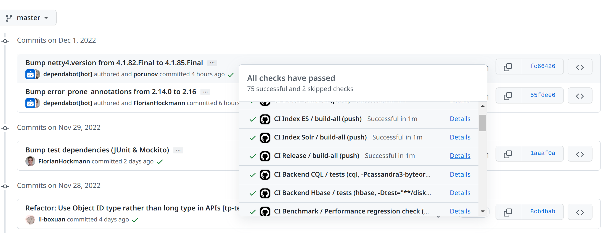

# Snapshot releases

In addition to official JanusGraph releases, JanusGraph publishes snapshot 
releases for each commit. The snapshot releases allow users to use latest 
JanusGraph features without relying on official JanusGraph releases.  
- Official JanusGraph releases are better tested and usually comes with finilized 
changes which signals that the used features and most likely to be stable for long term.
- Snapshot releases are not manually verified but instead verified by main CI tests as
well as scheduled full CI tests (once per week). New features in snapshot releases are not 
guaranteed to be compatible between commits. Thus, you may expect more breaking changes between 
snapshot releases and official releases.

## Maven repository artifacts

Official release are deployed to Sonatype OSS and are available in Sonatype Maven Central Repository. 
No authentication is needed to use such releases.  

Snapshot releases are deployed to GitHub Packages and are available in 
[JanusGraph GitHub Packages registry](https://github.com/orgs/janusgraph/packages?repo_name=janusgraph). 
Thus, such release are available only via GitHub authentication.  

To use snapshot releases in your Maven or Gradle build automation tool the next steps are required:
1. Generate GitHub token with read access to packages and public repository access.
2. Add JanusGraph GitHub Packages repository with higher priority to Maven Central repository. 

#### GitHub token generation

See detailed instruction on how to [create a personal access token in GitHub](https://docs.github.com/en/enterprise-server@3.4/authentication/keeping-your-account-and-data-secure/creating-a-personal-access-token).

Currently, to install public packages GitHub requires authentication. The minimum scope token needs to have to  
be able to install public packages is: `packages:read` and `public_repo`. When you create the token, notice that by default 
expiration time may be set which will prevent usage of this token after the expiration time. You may specify `No expiration` 
in case you don't want your token to be expired in the future.

To create a token you can click on your profile -> Settings -> Developer settings -> Personal access tokens -> 
Tokens (classic) -> Generate new token (classic).


After the token is generated it can be used to install JanusGraph public snapshot packages.

#### Placing JanusGraph GitHub Packages repository

Please, see detailed instruction on how to [define GitHub Package registry](https://docs.github.com/en/packages/working-with-a-github-packages-registry/working-with-the-apache-maven-registry#authenticating-to-github-packages).

JanusGraph GitHub Packages repository after Maven Central Repository to have a higher priority. Otherwise the official 
JanusGraph releases repository will be used which doesn't include any snapshot releases.

Uri used for Maven repository should be: https://maven.pkg.github.com/janusgraph/janusgraph

Example configurations for Maven and Gradle can be found below:

```xml tab='Maven'
<settings xmlns="http://maven.apache.org/SETTINGS/1.0.0"
  xmlns:xsi="http://www.w3.org/2001/XMLSchema-instance"
  xsi:schemaLocation="http://maven.apache.org/SETTINGS/1.0.0
                      http://maven.apache.org/xsd/settings-1.0.0.xsd">

  <activeProfiles>
    <activeProfile>github</activeProfile>
  </activeProfiles>

  <profiles>
    <profile>
      <id>github</id>
      <repositories>
        <repository>
          <id>central</id>
          <url>https://repo1.maven.org/maven2</url>
        </repository>
        <repository>
          <id>github</id>
          <url>https://maven.pkg.github.com/janusgraph/janusgraph</url>
          <snapshots>
            <enabled>true</enabled>
          </snapshots>
        </repository>
      </repositories>
    </profile>
  </profiles>

  <servers>
    <server>
      <id>github</id>
      <username>USERNAME</username>
      <password>TOKEN</password>
    </server>
  </servers>
</settings>
```

```groovy tab='Gradle'
subprojects {
    repositories {
        mavenCentral()
        maven {
            name = "JanusGraph GitHub Packages"
            url = uri("https://maven.pkg.github.com/janusgraph/janusgraph")
            credentials {
                username = project.findProperty("gpr.user") ?: System.getenv("USERNAME")
                password = project.findProperty("gpr.key") ?: System.getenv("TOKEN")
            }
        }
    }
}
```

## JanusGraph distribution builds

In addition to distribution builds provided for each official JanusGraph release, snapshot distribution builds are 
provided for all commits.

!!! info
    GitHub allows to download distribution builds only for authenticated GitHub users.

To access distribution build bundle for any commit, please, open commit you are interested in and select it's 
`CI Release` details. For example:


When `CI Release` page is opened for a specific commit, open summary and download the attached to `Artifacts` section 
file named `distribution-builds`. This will download `distribution-builds.zip` archive containing all distribution builds.


!!! warning
    Old snapshot distribution builds are expiring in GitHub due to timing and memory limits. It's not guaranteed that
    the snapshot distribution build downloaded yesterday is available today. We encourage to use either official release
    distribution builds or newer snapshot distribution builds.

If you see expired distribution builds or don't see any distribution builds for a specific commit, it means that it isn't 
available to be downloaded anymore. Thus, the distribution builds from newer commits should be used.

