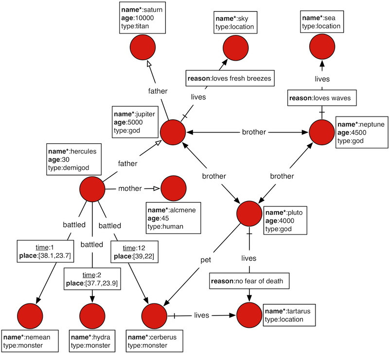
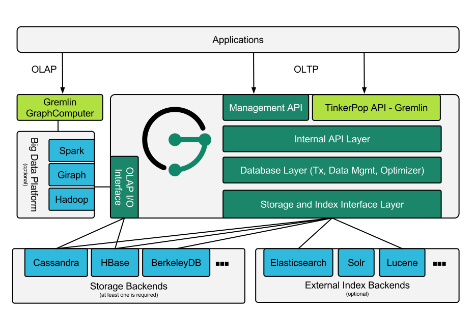

## The Benefits of JanusGraph

JanusGraph is designed to support the processing of graphs so large that
they require storage and computational capacities beyond what a single
machine can provide. Scaling graph data processing for real time
traversals and analytical queries is JanusGraph’s foundational benefit.
This section will discuss the various specific benefits of JanusGraph
and its underlying, supported persistence solutions.

### General JanusGraph Benefits

- Support for very large graphs. JanusGraph graphs scale with the
    number of machines in the cluster.
- Support for very many concurrent transactions and operational graph
    processing. JanusGraph’s transactional capacity scales with the
    number of machines in the cluster and answers complex traversal
    queries on huge graphs in milliseconds.
- Support for global graph analytics and batch graph processing
    through the Hadoop framework.
- Support for geo, numeric range, and full text search for vertices
    and edges on very large graphs.
- Native support for the popular property graph data model exposed by
    [Apache TinkerPop](https://tinkerpop.apache.org/).
- Native support for the graph traversal language
    [Gremlin](https://tinkerpop.apache.org/gremlin.html).
  - Numerous graph-level configurations provide knobs for tuning
    performance.
- Vertex-centric indices provide vertex-level querying to alleviate
    issues with the infamous [super node problem](http://thinkaurelius.com/2012/10/25/a-solution-to-the-supernode-problem/).
- Provides an optimized disk representation to allow for efficient use
    of storage and speed of access.
- Open source under the liberal [Apache 2 license](https://en.wikipedia.org/wiki/Apache_License).

### Benefits of JanusGraph with Apache Cassandra

<div style="float: right;">
    
</div>

-   [Continuously available](https://en.wikipedia.org/wiki/Continuous_availability)
    with no single point of failure.
-   No read/write bottlenecks to the graph as there is no master/slave
    architecture.

-   [Elastic scalability](https://en.wikipedia.org/wiki/Elastic_computing) allows
    for the introduction and removal of machines.
-   Caching layer ensures that continuously accessed data is available
    in memory.
-   Increase the size of the cache by adding more machines to the
    cluster.
-   Integration with [Apache Hadoop](https://hadoop.apache.org/).
-   Open source under the liberal Apache 2 license.

### Benefits of JanusGraph with HBase

<div style="float: right;">
    
</div>

-   Tight integration with the [Apache Hadoop](https://hadoop.apache.org/) ecosystem.
-   Native support for [strong consistency](https://en.wikipedia.org/wiki/Strong_consistency).
-   Linear scalability with the addition of more machines.
-   [Strictly consistent](https://en.wikipedia.org/wiki/Strict_consistency) reads and writes.
-   Convenient base classes for backing Hadoop
    [MapReduce](https://en.wikipedia.org/wiki/MapReduce) jobs with HBase
    tables.
-   Support for exporting metrics via
    [JMX](https://en.wikipedia.org/wiki/Java_Management_Extensions).
-   Open source under the liberal Apache 2 license.

### JanusGraph and the CAP Theorem

> Despite your best efforts, your system will experience enough faults
> that it will have to make a choice between reducing yield (i.e., stop
> answering requests) and reducing harvest (i.e., giving answers based
> on incomplete data). This decision should be based on business
> requirements.
>
> —  [Coda Hale](https://codahale.com/you-cant-sacrifice-partition-tolerance)

When using a database, the [CAP theorem](https://en.wikipedia.org/wiki/CAP_theorem) should be thoroughly
considered (C=Consistency, A=Availability, P=Partitionability).
JanusGraph is distributed with 3 supporting backends: [Apache Cassandra](https://cassandra.apache.org/),
 [Apache HBase](https://hbase.apache.org/), and [Oracle Berkeley DB Java Edition](https://www.oracle.com/technetwork/database/berkeleydb/overview/index-093405.html).
Note that BerkeleyDB JE is a non-distributed database and is typically
only used with JanusGraph for testing and exploration purposes.

HBase gives preference to consistency at the expense of yield, i.e. the
probability of completing a request. Cassandra gives preference to
availability at the expense of harvest, i.e. the completeness of the
answer to the query (data available/complete data).

## Getting Started
The examples in this section make extensive use of a toy graph
distributed with JanusGraph called *The Graph of the Gods*. This graph
is diagrammed below. The abstract data model is known as a 
[Property Graph Model](https://tinkerpop.apache.org/docs/{{ tinkerpop_version }}/reference#intro)
and this particular instance describes the relationships between the
beings and places of the Roman pantheon. Moreover, special text and
symbol modifiers in the diagram (e.g. bold, underline, etc.) denote
different schematics/typings in the graph.



| visual symbol | meaning |
| ------------- |-------------|
|bold key|a graph indexed key|
|bold key with star|a graph indexed key that must have a unique value|
|underlined key|a vertex-centric indexed key|
|hollow-head edge|a functional/unique edge (no duplicates)|
|tail-crossed edge|a unidirectional edge (can only traverse in one direction)|

### Downloading JanusGraph and Running the Gremlin Console

JanusGraph can be downloaded from the
[Releases](https://github.com/JanusGraph/janusgraph/releases) section of
the project repository. Once retrieved and unpacked, a Gremlin Console
can be opened. The Gremlin Console is a
[REPL](https://en.wikipedia.org/wiki/Read%E2%80%93eval%E2%80%93print_loop)
(i.e. interactive shell) that is distributed with JanusGraph and only
differs from the standard Gremlin Console insofar that JanusGraph is a
pre-installed and pre-loaded package. Alternatively, a user may choose
to install and activate JanusGraph in an existing Gremlin Console by
downloading the JanusGraph package from the central repository. In the
example below, `janusgraph.zip` is used, however, be sure to unzip the
zip-file that was downloaded.

!!! important
    JanusGraph requires Java 8 (Standard Edition). Oracle Java 8 is
    recommended. JanusGraph’s shell scripts expect that the `$JAVA_HOME`
    environment variable points to the directory where JRE or JDK is
    installed.

```bash
$ unzip janusgraph-{{ latest_version }}-hadoop2.zip
Archive:  janusgraph-{{ latest_version }}-hadoop2.zip
  creating: janusgraph-{{ latest_version }}-hadoop2/
...
$ cd janusgraph-{{ latest_version }}-hadoop2
$ bin/gremlin.sh

         \,,,/
         (o o)
-----oOOo-(3)-oOOo-----
09:12:24 INFO  org.apache.tinkerpop.gremlin.hadoop.structure.HadoopGraph  - HADOOP_GREMLIN_LIBS is set to: /usr/local/janusgraph/lib
plugin activated: tinkerpop.hadoop
plugin activated: janusgraph.imports
gremlin>
```

The Gremlin Console interprets commands using [Apache Groovy](https://www.groovy-lang.org/). 
Groovy is a superset of Java that
has various shorthand notations that make interactive programming
easier. Likewise Gremlin-Groovy is a superset of Groovy with various
shorthand notations that make graph traversals easy. The basic examples
below demonstrate handling numbers, strings, and maps. The remainder of
the tutorial will discuss graph-specific constructs.
```groovy
gremlin> 100-10
==>90
gremlin> "JanusGraph:" + " The Rise of Big Graph Data"
==>JanusGraph: The Rise of Big Graph Data
gremlin> [name:'aurelius', vocation:['philosopher', 'emperor']]
==>name=aurelius
==>vocation=[philosopher, emperor]
```

!!! tip
    Refer to [Apache TinkerPop](https://tinkerpop.apache.org/docs/{{ tinkerpop_version }}/reference),
    [SQL2Gremlin](http://sql2gremlin.com/), and [Gremlin Recipes](https://tinkerpop.apache.org/docs/{{ tinkerpop_version }}/recipes/)
    for more information about using Gremlin.

### Loading the Graph of the Gods Into JanusGraph

The example below will open a JanusGraph graph instance and load *The
Graph of the Gods* dataset diagrammed above. `JanusGraphFactory`
provides a set of static `open` methods, each of which takes a
configuration as its argument and returns a graph instance. This
tutorial calls one of these `open` methods on a configuration that uses
the [BerkeleyDB](storage-backend/bdb.md) storage backend and the
[Elasticsearch](index-backend/elasticsearch.md) index backend, then loads *The Graph of
the Gods* using the helper class `GraphOfTheGodsFactory`. This section
skips over the configuration details, but additional information about
storage backends, index backends, and their configuration are available
in [Storage Backends](storage-backend/index.md), [Index Backends](index-backend/search-predicates.md), and
[Configuration Reference](basics/configuration-reference.md).

```groovy
gremlin> graph = JanusGraphFactory.open('conf/janusgraph-berkeleyje-es.properties')
==>standardjanusgraph[berkeleyje:../db/berkeley]
gremlin> GraphOfTheGodsFactory.load(graph)
==>null
gremlin> g = graph.traversal()
==>graphtraversalsource[standardjanusgraph[berkeleyje:../db/berkeley], standard]
```

The `JanusGraphFactory.open() and GraphOfTheGodsFactory.load()` methods
do the following to the newly constructed graph prior to returning it:

1. Creates a collection of global and vertex-centric indices on the graph.
2. Adds all the vertices to the graph along with their properties.
3. Adds all the edges to the graph along with their properties.

Please see the [GraphOfTheGodsFactory source code](https://github.com/JanusGraph/janusgraph/blob/master/janusgraph-core/src/main/java/org/janusgraph/example/GraphOfTheGodsFactory.java)
for details.

For those using JanusGraph/Cassandra (or JanusGraph/HBase), be sure to
make use of `conf/janusgraph-cql-es.properties` (or
`conf/janusgraph-hbase-es.properties`) and
`GraphOfTheGodsFactory.load()`.

```groovy
gremlin> graph = JanusGraphFactory.open('conf/janusgraph-cql-es.properties')
==>standardjanusgraph[cql:[127.0.0.1]]
gremlin> GraphOfTheGodsFactory.load(graph)
==>null
gremlin> g = graph.traversal()
==>graphtraversalsource[standardjanusgraph[cql:[127.0.0.1]], standard]
```

You may also use the `conf/janusgraph-cql.properties`,
`conf/janusgraph-berkeleyje.properties`, or
`conf/janusgraph-hbase.properties` configuration files to open a graph
without an indexing backend configured. In such cases, you will need to
use the `GraphOfTheGodsFactory.loadWithoutMixedIndex()` method to load
the *Graph of the Gods* so that it doesn’t attempt to make use of an
indexing backend.
```groovy
gremlin> graph = JanusGraphFactory.open('conf/janusgraph-cql.properties')
==>standardjanusgraph[cql:[127.0.0.1]]
gremlin> GraphOfTheGodsFactory.loadWithoutMixedIndex(graph, true)
==>null
gremlin> g = graph.traversal()
==>graphtraversalsource[standardjanusgraph[cql:[127.0.0.1]], standard]
```
### Global Graph Indices


The typical pattern for accessing data in a graph database is to first
locate the entry point into the graph using a graph index. That entry
point is an element (or set of elements) — i.e. a vertex or edge. From
the entry elements, a Gremlin path description describes how to traverse
to other elements in the graph via the explicit graph structure.

Given that there is a unique index on `name` property, the Saturn vertex
can be retrieved. The property map (i.e. the key/value pairs of Saturn)
can then be examined. As demonstrated, the Saturn vertex has a `name` of
"saturn, " an `age` of 10000, and a `type` of "titan." The grandchild of
Saturn can be retrieved with a traversal that expresses: "Who is
Saturn’s grandchild?" (the inverse of "father" is "child"). The result
is Hercules.

```groovy
gremlin> saturn = g.V().has('name', 'saturn').next()
==>v[256]
gremlin> g.V(saturn).valueMap()
==>[name:[saturn], age:[10000]]
gremlin> g.V(saturn).in('father').in('father').values('name')
==>hercules
```

The property `place` is also in a graph index. The property `place` is
an edge property. Therefore, JanusGraph can index edges in a graph
index. It is possible to query *The Graph of the Gods* for all events
that have happened within 50 kilometers of
[Athens](https://en.wikipedia.org/wiki/Athens) (latitude:37.97 and
long:23.72). Then, given that information, which vertices were involved
in those events.

```groovy
gremlin> g.E().has('place', geoWithin(Geoshape.circle(37.97, 23.72, 50)))
==>e[a9x-co8-9hx-39s][16424-battled->4240]
==>e[9vp-co8-9hx-9ns][16424-battled->12520]
gremlin> g.E().has('place', geoWithin(Geoshape.circle(37.97, 23.72, 50))).as('source').inV().as('god2').select('source').outV().as('god1').select('god1', 'god2').by('name')
==>[god1:hercules, god2:hydra]
==>[god1:hercules, god2:nemean]
```
Graph indices are one type of index structure in JanusGraph. Graph
indices are automatically chosen by JanusGraph to answer which ask for
all vertices (`g.V`) or all edges (`g.E`) that satisfy one or multiple
constraints (e.g. `has` or `interval`). The second aspect of indexing in
JanusGraph is known as vertex-centric indices. Vertex-centric indices
are utilized to speed up traversals inside the graph. Vertex-centric
indices are described later.

#### Graph Traversal Examples

> [Hercules](https://en.wikipedia.org/wiki/Hercules), son of Jupiter and
> [Alcmene](https://en.wikipedia.org/wiki/Alcmene), bore super human
> strength. Hercules was a
> [Demigod](https://en.wikipedia.org/wiki/Demigod) because his father was
> a god and his mother was a human.
> [Juno](https://en.wikipedia.org/wiki/Juno_(mythology)), wife of
> Jupiter, was furious with Jupiter’s infidelity. In revenge, she
> blinded Hercules with temporary insanity and caused him to kill his
> wife and children. To atone for the slaying, Hercules was ordered by
> the [Oracle of Delphi](https://en.wikipedia.org/wiki/Oracle_at_Delphi)
> to serve [Eurystheus](https://en.wikipedia.org/wiki/Eurystheus).
> Eurystheus appointed Hercules to 12 labors.

In the previous section, it was demonstrated that Saturn’s grandchild
was Hercules. This can be expressed using a `loop`. In essence, Hercules
is the vertex that is 2-steps away from Saturn along the `in('father')`
path.
```groovy
gremlin> hercules = g.V(saturn).repeat(__.in('father')).times(2).next()
==>v[1536]
```

Hercules is a demigod. To prove that Hercules is half human and half
god, his parent’s origins must be examined. It is possible to traverse
from the Hercules vertex to his mother and father. Finally, it is
possible to determine the `type` of each of them — yielding "god" and
"human."
```groovy
gremlin> g.V(hercules).out('father', 'mother')
==>v[1024]
==>v[1792]
gremlin> g.V(hercules).out('father', 'mother').values('name')
==>jupiter
==>alcmene
gremlin> g.V(hercules).out('father', 'mother').label()
==>god
==>human
gremlin> hercules.label()
==>demigod
```

The examples thus far have been with respect to the genetic lines of the
various actors in the Roman pantheon. The [Property Graph Model](https://tinkerpop.apache.org/docs/{{ tinkerpop_version }}/reference#intro)
is expressive enough to represent multiple types of things and
relationships. In this way, *The Graph of the Gods* also identifies
Hercules' various heroic exploits --- his famous 12 labors. In the
previous section, it was discovered that Hercules was involved in two
battles near Athens. It is possible to explore these events by
traversing `battled` edges out of the Hercules vertex.
```groovy
gremlin> g.V(hercules).out('battled')
==>v[2304]
==>v[2560]
==>v[2816]
gremlin> g.V(hercules).out('battled').valueMap()
==>[name:[nemean]]
==>[name:[hydra]]
==>[name:[cerberus]]
gremlin> g.V(hercules).outE('battled').has('time', gt(1)).inV().values('name')
==>cerberus
==>hydra
```

The edge property `time` on `battled` edges is indexed by the
vertex-centric indices of a vertex. Retrieving `battled` edges incident
to Hercules according to a constraint/filter on `time` is faster than
doing a linear scan of all edges and filtering (typically `O(log n)`,
where `n` is the number incident edges). JanusGraph is intelligent
enough to use vertex-centric indices when available. A `toString()` of a
Gremlin expression shows a decomposition into individual steps.

```groovy
gremlin> g.V(hercules).outE('battled').has('time', gt(1)).inV().values('name').toString()
==>[GraphStep([v[24744]],vertex), VertexStep(OUT,[battled],edge), HasStep([time.gt(1)]), EdgeVertexStep(IN), PropertiesStep([name],value)]
```

#### More Complex Graph Traversal Examples

> In the depths of Tartarus lives Pluto. His relationship with Hercules
> was strained by the fact that Hercules battled his pet, Cerberus.
> However, Hercules is his nephew — how should he make Hercules pay for
> his insolence?

The Gremlin traversals below provide more examples over *The Graph of
the Gods*. The explanation of each traversal is provided in the prior
line as a `//` comment.

##### Cohabiters of Tartarus
```groovy
gremlin> pluto = g.V().has('name', 'pluto').next()
==>v[2048]
gremlin> // who are pluto's cohabitants?
gremlin> g.V(pluto).out('lives').in('lives').values('name')
==>pluto
==>cerberus
gremlin> // pluto can't be his own cohabitant
gremlin> g.V(pluto).out('lives').in('lives').where(is(neq(pluto))).values('name')
==>cerberus
gremlin> g.V(pluto).as('x').out('lives').in('lives').where(neq('x')).values('name')
==>cerberus
```

##### Pluto’s Brothers

```groovy
gremlin> // where do pluto's brothers live?
gremlin> g.V(pluto).out('brother').out('lives').values('name')
==>sky
==>sea
gremlin> // which brother lives in which place?
gremlin> g.V(pluto).out('brother').as('god').out('lives').as('place').select('god', 'place')
==>[god:v[1024], place:v[512]]
==>[god:v[1280], place:v[768]]
gremlin> // what is the name of the brother and the name of the place?
gremlin> g.V(pluto).out('brother').as('god').out('lives').as('place').select('god', 'place').by('name')
==>[god:jupiter, place:sky]
==>[god:neptune, place:sea]
```

Finally, Pluto lives in Tartarus because he shows no concern for death.
His brothers, on the other hand, chose their locations based upon their
love for certain qualities of those locations.!
```groovy
gremlin> g.V(pluto).outE('lives').values('reason')
==>no fear of death
gremlin> g.E().has('reason', textContains('loves'))
==>e[6xs-sg-m51-e8][1024-lives->512]
==>e[70g-zk-m51-lc][1280-lives->768]
gremlin> g.E().has('reason', textContains('loves')).as('source').values('reason').as('reason').select('source').outV().values('name').as('god').select('source').inV().values('name').as('thing').select('god', 'reason', 'thing')
==>[god:neptune, reason:loves waves, thing:sea]
==>[god:jupiter, reason:loves fresh breezes, thing:sky]
```

## Architectural Overview
JanusGraph is a graph database engine. JanusGraph itself is focused on
compact graph serialization, rich graph data modeling, and efficient
query execution. In addition, JanusGraph utilizes Hadoop for graph
analytics and batch graph processing. JanusGraph implements robust,
modular interfaces for data persistence, data indexing, and client
access. JanusGraph’s modular architecture allows it to interoperate with
a wide range of storage, index, and client technologies; it also eases
the process of extending JanusGraph to support new ones.

Between JanusGraph and the disks sits one or more storage and indexing
adapters. JanusGraph comes standard with the following adapters, but
JanusGraph’s modular architecture supports third-party adapters.

-   Data storage:
    -   [Apache Cassandra](storage-backend/cassandra.md)
    -   [Apache HBase](storage-backend/hbase.md)
    -   [Oracle Berkeley DB Java Edition](storage-backend/bdb.md)
-   Indices, which speed up and enable more complex queries:
    -   [Elasticsearch](index-backend/elasticsearch.md)
    -   [Apache Solr](index-backend/solr.md)
    -   [Apache Lucene](index-backend/lucene.md)

Broadly speaking, applications can interact with JanusGraph in two ways:

-   Embed JanusGraph inside the application executing
    [Gremlin](https://tinkerpop.apache.org/docs/{{ tinkerpop_version }}/reference#graph-traversal-steps)
    queries directly against the graph within the same JVM. Query
    execution, JanusGraph’s caches, and transaction handling all happen
    in the same JVM as the application while data retrieval from the
    storage backend may be local or remote.

-   Interact with a local or remote JanusGraph instance by submitting
    Gremlin queries to the server. JanusGraph natively supports the
    Gremlin Server component of the [Apache TinkerPop](https://tinkerpop.apache.org/) stack.


