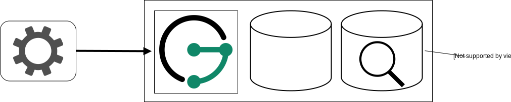

# Deployment Scenarios

JanusGraph offers a wide choice of storage and index backends which
results in great flexibility of how it can be deployed. This chapter
presents a few possible deployment scenarios to help with the complexity
that comes with this flexibility.

Before discussing the different deployment scenarios, it is important to
understand the roles of JanusGraph itself and that of the backends.
First of all, applications only communicate directly with JanusGraph,
mostly by sending Gremlin traversals for execution. JanusGraph then
communicates with the configured backends to execute the received
traversal. When JanusGraph is used in the form of JanusGraph Server,
then there is nothing like a *master* JanusGraph Server. Applications
can therefore connect to any JanusGraph Server instance. They can also
use a load-balancer to schedule requests to the different instances. The
JanusGraph Server instances themselves don’t communicate to each other
directly which makes it easy to scale them when the need arises to
process more traversals.

!!! note
    The scenarios presented in this chapter are only examples of how
    JanusGraph can be deployed. Each deployment needs to take into account
    the concrete use cases and production needs.

## Getting Started Scenario

This scenario is the scenario most users probably want to choose when
they are just getting started with JanusGraph. It offers scalability and
fault tolerance with a minimum number of servers required. JanusGraph
Server runs together with an instance of the storage backend and
optionally also an instance of the index backend on every server.

A setup like this can be extended by simply adding more servers of the
same kind or by moving one of the components onto dedicated servers. The
latter describes a growth path to transform the deployment into the
[Advanced Scenario](#advanced-scenario).

Any of the scalable storage backends can be used with this scenario.
Note however that for Scylla [some configuration is required when it is
hosted co-located with other
services](http://docs.scylladb.com/getting-started/scylla_in_a_shared_environment/)
like in this scenario. When an index backend should be used in this
scenario then it also needs to be one that is scalable.

## Advanced Scenario

The advanced scenario is an evolution of the [Getting Started Scenario](#getting-started-scenario).
 Instead of hosting the JanusGraph
Server instances together with the storage backend and optionally also
the index backend, they are now separated on different servers. The
advantage of hosting the different components (JanusGraph Server,
storage/index backend) on different servers is that they can be scaled
and managed independently of each other. This offers a higher
flexibility at the cost of having to maintain more servers.

Since this scenario offers independent scalability of the different
components, it of course makes most sense to also use scalable backends.

## Minimalist Scenario

It is also possible to host JanusGraph Server together with the
backend(s) on just one server. This is especially attractive for testing
purposes or for example when JanusGraph just supports a single
application which can then also run on the same server.

Opposed to the previous scenarios, it makes most sense to use backends
for this scenario that are not scalable. The in-memory backend can be
used for testing purposes or Berkeley DB for production and Lucene as
the optional index backend.

## Embedded JanusGraph

Instead of connecting to the JanusGraph Server from an application it is
also possible to embed JanusGraph as a library inside a JVM based
application. While this reduces the administrative overhead, it makes it
impossible to scale JanusGraph independently of the application.
Embedded JanusGraph can be deployed as a variation of any of the other
scenarios. JanusGraph just moves from the server(s) directly into the
application as its now just used as a library instead of an independent
service.
