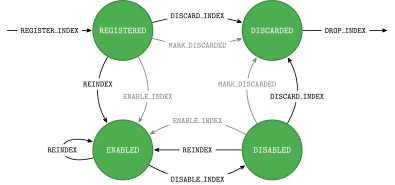

# Index Lifecycle

JanusGraph uses only indexes which have status `ENABLED`. 
When the index is created it will not be used by JanusGraph until it is enabled. 
After the index is build you should wait until it is registered (i.e. available) by JanusGraph:
```java
//Wait for the index to become available (i.e. wait for status REGISTERED)
ManagementSystem.awaitGraphIndexStatus(graph, "myIndex").call();
```

After the index is registered we should either enable the index (if we are sure that the current data should not be
indexed by the newly created index) or we should reindex current data so that it would be available in the newly created
index.

Reindex the existing data and automatically enable the index example:
```java
mgmt = graph.openManagement();
mgmt.updateIndex(mgmt.getGraphIndex("myIndex"), SchemaAction.REINDEX).get();
mgmt.commit();
```

Enable the index without reindexing existing data example:
```java
mgmt = graph.openManagement();
mgmt.updateIndex(mgmt.getGraphIndex("myAnotherIndex"), SchemaAction.ENABLE_INDEX).get();
mgmt.commit();
```

## Index states and transitions

The diagram below shows the possible states of an index in JanusGraph.
Transitions which should be used with caution are shown in grey.
These are either not recommended to be used in production scenarios or have more complex implications to be aware of.

{: style="width:100%;"}

## States (SchemaStatus)
An index can be in one of the following states:

**INSTALLED**

:   The index has been created on the current JanusGraph instance, but it is not yet known to all instances in the
    cluster.
    This state is not shown in the diagram above because it is not stable in terms of synchronization between instances.

**REGISTERED**

:   The index is known to all instances in the cluster.
    However, it is not in use yet.
    In this state, the index contains no data and will not be used in queries.

**ENABLED**

:   The index is enabled and can be used to answer queries.
    Furthermore, this is the only state in which insertions and deletions in the graph are forwarded to the index.

**DISABLED**

:   The index is disabled and will not be used to answer queries.
    It also does no longer receive graph updates.
    Therefore, it is recommended to use `REINDEX` to re-enable the index.

**DISCARDED**

:   The index has been decommissioned and its contents have been deleted.
    The only remaining artifact is the schema vertex representing the index.

## Actions (SchemaAction)
The following actions can be performed on an index to change its state via `mgmt.updateIndex()`:

**REGISTER_INDEX**
:   Registers the index with all instances in the cluster.
    After an index is installed, it must be registered with all JanusGraph instances.

**REINDEX**
:   Re-builds the index from the ground up using the data stored in the graph.
    Depending on the size of the graph, this action can take a long time to complete.
    Reindexing is possible in all stable states and automatically enables the index once finished.

**ENABLE_INDEX**
:   Enables the index so that it can be used by the query processing engine.
    An index must be registered before it can be enabled.
    If enabling the index manually instead of performing a reindex, be aware that past modifications of the graph are
    not represented in the index.
    Enabling a previously disabled index without `REINDEX` may cause index queries to return ghost vertices, which have
    been deleted from the graph while the index was disabled.

**DISABLE_INDEX**
:   Disables the index temporarily so that it is no longer used to answer queries.
    The index also stops receiving updates in the graph.

**DISCARD_INDEX**
:   Removes all data from the index, preparing it for removal.
    This operation is supported for all composite indices and for some mixed index backends.
    For more information on index removal see [Removal](index-removal.md).

**MARK_DISCARDED**
:   All indices which can not be discarded using **DISCARD_INDEX** have to be discarded manually in the backend.
    As this is not recognized by JanusGraph automatically, the state can be set to **DISCARDED** manually via this
    action.

**DROP_INDEX**
:   Removes the index from the schema and communicates the change to other instances in the cluster.
    After an index has been dropped, a new index is allowed to use the same name again.
