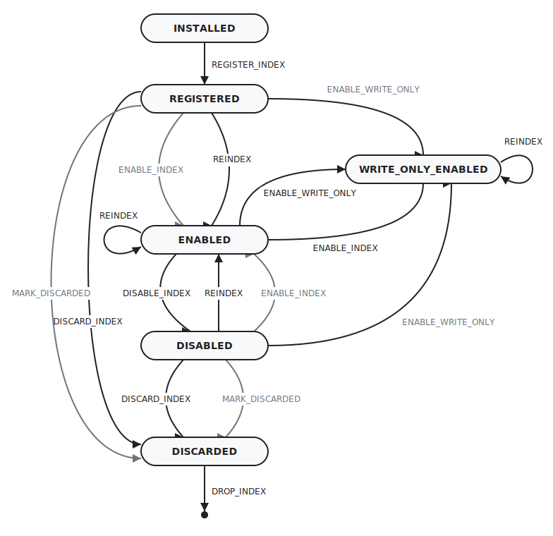

# Index Lifecycle

JanusGraph uses only indexes which have status `ENABLED` to answer queries.
When the index is created it will not be used by JanusGraph until it is enabled. 
After the index is build you should wait until it is registered (i.e. available) by JanusGraph:
```java
//Wait for the index to become available (i.e. wait for status REGISTERED)
ManagementSystem.awaitGraphIndexStatus(graph, "myIndex").call();
```

After the index is registered we should either enable the index (if we are sure that the current data should not be
indexed by the newly created index) or we should reindex current data so that it would be available in the newly created
index.

Reindex the existing data and automatically enable the index example:
```java
mgmt = graph.openManagement();
mgmt.updateIndex(mgmt.getGraphIndex("myIndex"), SchemaAction.REINDEX).get();
mgmt.commit();
```

Enable the index without reindexing existing data example:
```java
mgmt = graph.openManagement();
mgmt.updateIndex(mgmt.getGraphIndex("myAnotherIndex"), SchemaAction.ENABLE_INDEX).get();
mgmt.commit();
```

## Index states and transitions

The diagram below shows the possible states of an index in JanusGraph.
Transitions which should be used with caution are shown in grey.
These are either not recommended to be used in production scenarios or have more complex implications to be aware of.

{: style="width:100%;"}

## States (SchemaStatus)
An index can be in one of the following states:

**INSTALLED**

:   The index has been created on the current JanusGraph instance, but it is not yet known to all instances in the
    cluster. Instances which already know about the index forward insertions and deletions in the graph to the index,
    but the index is not used to answer queries.
    This state is not stable in terms of synchronization between instances: waiting for the `REGISTERED` status is
    required before any reindexing decision can be made.

**REGISTERED**

:   The index is known to all instances in the cluster and every instance forwards insertions and deletions in the
    graph to the index. The index is not used to answer queries.
    Because all instances are guaranteed to write to the index in this state, it is safe to reindex existing data.
    `REGISTERED` is a transitional state: `REINDEX` automatically enables a `REGISTERED` index once reindexing is
    finished. If the index should stay write-only instead, move it to `WRITE_ONLY_ENABLED` via `ENABLE_WRITE_ONLY`.

**WRITE_ONLY_ENABLED**

:   The index is enabled for write operations only. Insertions and deletions in the graph are forwarded to the index,
    but the index is not used to answer queries.
    In contrast to `REGISTERED`, this state expresses the explicit intent to keep the index write-only: `REINDEX`
    preserves this state instead of automatically enabling the index.
    This is useful when building an index on a live system: the index can receive writes and be reindexed (possibly
    multiple times), and once it has caught up, it can be fully enabled with `ENABLE_INDEX` — without any further
    reindexing. It can also be used to temporarily exclude an `ENABLED` index from query answering while keeping it
    up-to-date, so that it can be re-enabled later without a reindex.

    !!! info
        `WRITE_ONLY_ENABLED` was added in JanusGraph 1.2.0. Older JanusGraph versions cannot read schemas that
        contain this status, so only start using it after all instances in the cluster have been upgraded.

**ENABLED**

:   The index is enabled and used to answer queries. Insertions and deletions in the graph are forwarded to the index.

**DISABLED**

:   The index is disabled and will not be used to answer queries.
    It also no longer receives graph updates, so its contents become stale over time.
    Therefore, it is recommended to use `REINDEX` to re-enable the index.

**DISCARDED**

:   The index has been decommissioned and its contents have been deleted.
    The only remaining artifact is the schema vertex representing the index.

!!! note
    Writes reach an index in the `INSTALLED`, `REGISTERED`, `WRITE_ONLY_ENABLED` and `ENABLED` states. Queries are
    answered only by indexes in the `ENABLED` state. Earlier versions of this page stated that only `ENABLED` indexes
    receive updates; that was never the case — forwarding writes while an index is `INSTALLED`/`REGISTERED` is what
    makes the register-then-reindex workflow lossless.

## Actions (SchemaAction)
The following actions can be performed on an index to change its state via `mgmt.updateIndex()`:

**REGISTER_INDEX**
:   Registers the index with all instances in the cluster.
    After an index is installed, it must be registered with all JanusGraph instances.
    A `DISABLED` index can also be re-registered: this is the required activation step before reindexing a previously
    disabled index, because reaching the `REGISTERED` status guarantees that all instances write to the index again.

**ENABLE_WRITE_ONLY**
:   Enables the index for write operations only (state `WRITE_ONLY_ENABLED`). The index receives updates during graph
    mutations and reindexing, but is not used to answer queries.
    This action can be applied to a `REGISTERED` index (deferred enablement) or to an `ENABLED` index (demotion:
    stop using the index for queries while keeping it up-to-date).
    It cannot be applied to a `DISABLED` index directly — re-register the index first (`REGISTER_INDEX`), otherwise
    there would be no guarantee that all instances write to the index before a subsequent reindex starts.

**REINDEX**
:   Re-builds the index from the ground up using the data stored in the graph.
    Depending on the size of the graph, this action can take a long time to complete.
    Reindexing is possible in all stable states and automatically enables the index once finished, with one exception:
    if the index is in the `WRITE_ONLY_ENABLED` state, reindexing keeps it in `WRITE_ONLY_ENABLED` instead of
    automatically enabling it for queries. For a mixed index, the index counts as write-only if any of its keys has
    the `WRITE_ONLY_ENABLED` status.

**REMOVE_STALE_ENTRIES**
:   Removes stale index entries: entries which reference elements that no longer exist in the graph (see
    [Consistency during status transitions](#consistency-during-status-transitions)). This action complements
    `REINDEX`: a reindex restores missing entries for existing elements but never removes entries, while this action
    removes entries of deleted elements but never adds entries. The index status is not changed by this action.
    Only global graph indexes are supported. For a composite index the internal index store is scanned. For a mixed
    index the documents are enumerated through exists-queries against the index backend, which requires at least one
    index field whose data type supports exists queries; fields that do not support them are skipped with a warning.
    The returned metrics report the number of removed entries under the custom metric `stale-entries-removed`.

    !!! warning
        If custom vertex ids are used, deleting a vertex and re-creating it under the same custom id concurrently
        with a running `REMOVE_STALE_ENTRIES` job can remove the index entries of the re-created vertex. Run the
        cleanup during periods in which custom ids are not recycled, or run `REINDEX` afterwards to restore such
        entries. With automatically assigned ids this race cannot occur because ids are never reused.

**ENABLE_INDEX**
:   Enables the index so that it can be used by the query processing engine.
    An index must be registered before it can be enabled.
    If enabling the index manually instead of performing a reindex, be aware that past modifications of the graph are
    not represented in the index. This concern does not apply when enabling a `WRITE_ONLY_ENABLED` index that has
    been reindexed, because such an index keeps receiving all writes.
    Enabling a previously disabled index may cause index queries to return ghost vertices: `REINDEX` restores missing
    and outdated entries for elements that still exist, but it cannot remove stale entries for elements that were
    deleted while the index was disabled (see
    [Consistency during status transitions](#consistency-during-status-transitions)).

**DISABLE_INDEX**
:   Disables the index temporarily so that it is no longer used to answer queries.
    The index also stops receiving updates in the graph.
    An index can also be disabled within the same management transaction that creates it. Such an index is known to
    all instances (after the schema change has propagated) but never receives any writes, which allows index
    definitions to be rolled out long before they are activated via `REGISTER_INDEX`.

**DISCARD_INDEX**
:   Removes all data from the index, preparing it for removal.
    This operation is supported for all composite indices and for some mixed index backends.
    For more information on index removal see [Removal](index-removal.md).

**MARK_DISCARDED**
:   All indices which can not be discarded using **DISCARD_INDEX** have to be discarded manually in the backend.
    As this is not recognized by JanusGraph automatically, the state can be set to **DISCARDED** manually via this
    action.

**DROP_INDEX**
:   Removes the index from the schema and communicates the change to other instances in the cluster.
    After an index has been dropped, a new index is allowed to use the same name again.

## Consistency during status transitions

Index status changes propagate asynchronously through the cluster: after a management transaction commits a status
change, every other instance applies it only once it has processed the corresponding cache eviction. During this
propagation window, instances may briefly disagree about the status of an index and therefore about whether graph
mutations have to be forwarded to it.

The index lifecycle is designed so that this window cannot cause *missing* entries in an index that is taken through
the documented workflows: an index receives writes from the moment an instance learns about it (`INSTALLED`), and the
`REGISTERED` status is only set after **all** instances have acknowledged the index. Once `REGISTERED` is reached,
every instance is guaranteed to forward mutations to the index, so a `REINDEX` executed after awaiting `REGISTERED`
restores every element that was added or modified before or during the propagation window.

Deletions behave differently: an instance can only delete an entry from an index it already knows about. If an
element is deleted during a propagation window by an instance that does not yet know the index (or that already
considers the index `DISABLED` while other instances still write to it), the element's entry remains in the index as
a **stale entry**. Be aware of the following properties of stale entries:

-   `REINDEX` does **not** remove them. A reindex only adds and overwrites entries for elements that currently exist
    in the graph; it never visits deleted elements and cannot clean up their leftover entries.
-   Stale entries can surface in query results as ghost vertices. See
    [Ghost Vertices](../../advanced-topics/eventual-consistency.md#ghost-vertices) for the general discussion and the
    read-time mitigation (`checkInternalVertexExistence()`).
-   Use `REMOVE_STALE_ENTRIES` to remove them: it scans the index and deletes every entry whose element no longer
    exists in the graph. A full index heal is therefore `REMOVE_STALE_ENTRIES` (removes entries of deleted elements)
    combined with `REINDEX` (restores missing entries of existing elements):

    ```java
    mgmt = graph.openManagement();
    mgmt.updateIndex(mgmt.getGraphIndex("myIndex"), SchemaAction.REMOVE_STALE_ENTRIES).get();
    mgmt.commit();
    ```

The exposure is bounded: only elements **deleted while a status change is propagating** (typically a management-log
round trip of a few seconds) can leave stale entries. If possible, perform index registration and activation during
periods with few deletions.

## Write-Only Index Workflows

### Build an index on a live system and enable it later

When adding an index to a live system with ongoing data ingestion, the write-only workflow allows reindexing the
existing data without automatically enabling the index, so that the operator decides when the index starts serving
queries. No writes are missed at any point: the index receives all graph updates from the moment it is registered.

```java
// 1. Create the index and wait for it to be registered on all instances
mgmt = graph.openManagement();
mgmt.buildIndex("myIndex", Vertex.class).addKey(mgmt.getPropertyKey("myKey")).buildCompositeIndex();
mgmt.commit();
ManagementSystem.awaitGraphIndexStatus(graph, "myIndex").call();

// 2. Enable the index for writes only
mgmt = graph.openManagement();
mgmt.updateIndex(mgmt.getGraphIndex("myIndex"), SchemaAction.ENABLE_WRITE_ONLY).get();
mgmt.commit();

// 3. Reindex existing data (the index stays in WRITE_ONLY_ENABLED after reindexing)
mgmt = graph.openManagement();
mgmt.updateIndex(mgmt.getGraphIndex("myIndex"), SchemaAction.REINDEX).get();
mgmt.commit();

// 4. Whenever ready: fully enable the index for queries (no additional reindex is needed)
mgmt = graph.openManagement();
mgmt.updateIndex(mgmt.getGraphIndex("myIndex"), SchemaAction.ENABLE_INDEX).get();
mgmt.commit();
```

### Temporarily exclude an index from query answering

An `ENABLED` index can be demoted to `WRITE_ONLY_ENABLED` (for example while investigating query planner issues or
index inconsistencies). The index keeps receiving all writes, so it can be re-enabled at any time without a reindex:

```java
mgmt = graph.openManagement();
mgmt.updateIndex(mgmt.getGraphIndex("myIndex"), SchemaAction.ENABLE_WRITE_ONLY).get();
mgmt.commit();

// ... later, no reindex required:
mgmt = graph.openManagement();
mgmt.updateIndex(mgmt.getGraphIndex("myIndex"), SchemaAction.ENABLE_INDEX).get();
mgmt.commit();
```

### Roll out an index definition without using it

An index can be created and disabled within the same management transaction. Such an index is known to the whole
cluster but neither receives writes nor answers queries, so it adds no write amplification until it is activated:

```java
mgmt = graph.openManagement();
index = mgmt.buildIndex("myIndex", Vertex.class).addKey(mgmt.getPropertyKey("myKey")).buildCompositeIndex();
mgmt.updateIndex(index, SchemaAction.DISABLE_INDEX);
mgmt.commit();
```

To activate it later, re-register it first (this guarantees that all instances write to the index), then reindex
and/or enable it:

```java
mgmt = graph.openManagement();
mgmt.updateIndex(mgmt.getGraphIndex("myIndex"), SchemaAction.REGISTER_INDEX).get();
mgmt.commit();
ManagementSystem.awaitGraphIndexStatus(graph, "myIndex").status(SchemaStatus.REGISTERED).call();

// Either REINDEX (automatically enables), or ENABLE_WRITE_ONLY + REINDEX + ENABLE_INDEX as shown above
mgmt = graph.openManagement();
mgmt.updateIndex(mgmt.getGraphIndex("myIndex"), SchemaAction.REINDEX).get();
mgmt.commit();
```
