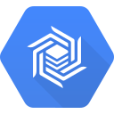

# Google Cloud Bigtable



> Cloud Bigtable is Google’s NoSQL Big Data database service. It’s the
> same database that powers many core Google services, including Search,
> Analytics, Maps, and Gmail.
>
> Bigtable is designed to handle massive workloads at consistent low
> latency and high throughput, so it’s a great choice for both
> operational and analytical applications, including IoT, user
> analytics, and financial data analysis.
>
> —  [Google Cloud Bigtable
> Homepage](https://cloud.google.com/bigtable/)

## Bigtable Setup

Bigtable implements the HBase interface for all data access operations,
and requires a few configuration options to connect.

### Connecting to Bigtable

Configuring JanusGraph to connect to Bigtable is achieved by using the
`hbase` backend, along with a custom connection implementation, the
project id of the Google Cloud Platform project containing the Bigtable
instance, and the Cloud Bigtable instance id you are connecting to.

Example:
```properties
storage.backend=hbase
storage.hbase.ext.hbase.client.connection.impl=com.google.cloud.bigtable.hbase2_x.BigtableConnection
storage.hbase.ext.google.bigtable.project.id=<Google Cloud Platform project id>
storage.hbase.ext.google.bigtable.instance.id=<Bigtable instance id>
```
