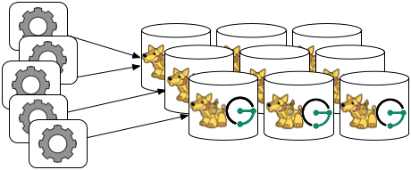

Apache Cassandra
================

> The Apache Cassandra database is the right choice when you need
> scalability and high availability without compromising performance.
> Linear scalability and proven fault-tolerance on commodity hardware or
> cloud infrastructure make it the perfect platform for mission-critical
> data. Cassandra’s support for replicating across multiple datacenters
> is best-in-class, providing lower latency for your users and the peace
> of mind of knowing that you can survive regional outages. The largest
> known Cassandra cluster has over 300 TB of data in over 400 machines.
>
> —  [Apache Cassandra Homepage](http://cassandra.apache.org/)

The following sections outline the various ways in which JanusGraph can
be used in concert with Apache Cassandra.

Cassandra Storage Backend
-------------------------

JanusGraph provides the following backends for use with Cassandra:

-   `cql` - CQL based driver. This is the recommended driver.
-   `cassandrathrift` - JanusGraph’s Thrift connection pool driver
-   `cassandra` - [Astyanax](https://github.com/Netflix/astyanax)
    driver. The Astyanax project is
    [retired](https://medium.com/netflix-techblog/astyanax-retiring-an-old-friend-6cca1de9ac4).
-   `embeddedcassandra` - Embedded driver for running Cassandra and
    JanusGraph within the same JVM

Cassandra has two protocols for clients to use: CQL and Thrift. Thrift
was the original interface, however it was deprecated starting with
Cassandra 2.1. The core of JanusGraph was originally written before the
deprecation of Thrift, and it has several classes that support Thrift.
With Cassandra 4.0, Thrift support will be removed in Cassandra.
JanusGraph users are recommended to use the `cql` storage backend.

!!! note
    If you plan to use a Thrift-based driver and you are using Cassandra
    2.2 or higher, you need to explicitly enable Thrift so that JanusGraph
    can connect to the cluster. Do so by running
    `./bin/nodetool enablethrift` on every Cassandra node.

!!! note
    If security is enabled on Cassandra, the user must have
    `CREATE permission on <all keyspaces>`, otherwise the keyspace must be
    created ahead of time by an administrator including the required
    tables or the user must have
    `CREATE permission on <the configured keyspace>`. The create table
    file containing the required tables is located in
    `conf/cassandra/cassandraTables.cql`. Please define your keyspace
    before executing it.

Local Server Mode
-----------------


Cassandra can be run as a standalone database on the same local host as
JanusGraph and the end-user application. In this model, JanusGraph and
Cassandra communicate with one another via a `localhost` socket. Running
JanusGraph over Cassandra requires the following setup steps:

1.  [Download Cassandra](http://cassandra.apache.org/download/), unpack
    it, and set filesystem paths in `conf/cassandra.yaml` and
    `conf/log4j-server.properties`
2.  Connecting Gremlin Server to Cassandra using the default
    configuration files provided in the pre-packaged distribution
    requires that Cassandra Thrift is enabled. To enable Cassandra
    Thrift open `conf/cassandra.yaml` and update `start_rpc: false` to
    `start_rpc: true`. If Cassandra is already running Thrift can be
    started manually with `bin/nodetool enablethrift`. the Thrift status
    can be verified with `bin/nodetool` statusthrift.
3.  Start Cassandra by invoking `bin/cassandra -f` on the command line
    in the directory where Cassandra was unpacked. Read output to check
    that Cassandra started successfully.

    Now, you can create a Cassandra JanusGraph as follows  
```java
JanusGraph g = JanusGraphFactory.build().
set("storage.backend", "cql").
set("storage.hostname", "127.0.0.1").
open();
```

In the Gremlin Console, you can not define the type of the variables
`conf` and `g`. Therefore, simply leave off the type declaration.

Local Container Mode
--------------------

Cassandra does not have a native install for Windows or OSX. One of the
easiest ways to run Cassandra on OSX, Windows, or Linux is to use a
Docker Container. You can download and run Cassandra with a single
[Docker](https://www.docker.com/) command. It is important to install a
version that is supported by the version of JanusGraph you intend to
use. The compatible versions can be found under the Tested Compatibility
section of the specific release on the [Releases
page](https://github.com/JanusGraph/janusgraph/releases). The [Cassandra
Docker Hub page](https://hub.docker.com/_/cassandra/) can be referenced
for the available versions and useful commands. In the command below an
environment variable is being set to enable Cassandra Thrift with
`-e CASSANDRA_START_RPC=true`. A description of the ports can be found
[here](https://docs.datastax.com/en/cassandra/latest/cassandra/configuration/secureFireWall.html).
Port 9160 is used for the Thrift client API. Port 9042 is for CQL native
clients. Ports 7000, 7001 and 7099 are for inter-node communication.
Version 3.11 of Cassandra was the latest compatible version for
JanusGraph 0.2.0 and is specified in the reference command below.

```bash
docker run --name jg-cassandra -d -e CASSANDRA_START_RPC=true -p 9160:9160 \
  -p 9042:9042 -p 7199:7199 -p 7001:7001 -p 7000:7000 cassandra:3.11
```

Remote Server Mode
------------------


When the graph needs to scale beyond the confines of a single machine,
then Cassandra and JanusGraph are logically separated into different
machines. In this model, the Cassandra cluster maintains the graph
representation and any number of JanusGraph instances maintain
socket-based read/write access to the Cassandra cluster. The end-user
application can directly interact with JanusGraph within the same JVM as
JanusGraph.

For example, suppose we have a running Cassandra cluster where one of
the machines has the IP address 77.77.77.77, then connecting JanusGraph
with the cluster is accomplished as follows (comma separate IP addresses
to reference more than one machine):
```java
JanusGraph graph = JanusGraphFactory.build().
  set("storage.backend", "cql").
  set("storage.hostname", "77.77.77.77").
  open();
```

In the Gremlin Console, you can not define the type of the variables
`conf` and `g`. Therefore, simply leave off the type declaration.

Remote Server Mode with Gremlin Server
--------------------------------------


Gremlin Server can be wrapped around each JanusGraph instance defined in
the previous subsection. In this way, the end-user application need not
be a Java-based application as it can communicate with Gremlin Server as
a client. This type of deployment is great for polyglot architectures
where various components written in different languages need to
reference and compute on the graph.

Start Gremlin Server using `bin/gremlin-server.sh` and then in an
external Gremlin Console session using `bin/gremlin.sh` you can send
Gremlin commands over the wire:
```groovy
:plugin use tinkerpop.server
:remote connect tinkerpop.server conf/remote.yaml
:> g.addV()
```

In this case, each Gremlin Server would be configured to connect to the
Cassandra cluster. The following shows the graph specific fragment of
the Gremlin Server configuration. Refer to [JanusGraph Server](../basics/server.md) for a complete
example and more information on how to configure the server.

```yaml
...
graphs: {
  g: conf/janusgraph-cql.properties
}
scriptEngines: {
  gremlin-groovy: {
    plugins: { org.janusgraph.graphdb.tinkerpop.plugin.JanusGraphGremlinPlugin: {},
               org.apache.tinkerpop.gremlin.server.jsr223.GremlinServerGremlinPlugin: {},
               org.apache.tinkerpop.gremlin.tinkergraph.jsr223.TinkerGraphGremlinPlugin: {},
               org.apache.tinkerpop.gremlin.jsr223.ImportGremlinPlugin: {classImports: [java.lang.Math], methodImports: [java.lang.Math#*]},
               org.apache.tinkerpop.gremlin.jsr223.ScriptFileGremlinPlugin: {files: [scripts/empty-sample.groovy]}}}}
...
```

For more information about Gremlin Server see the [Apache TinkerPop
documentation](https://tinkerpop.apache.org/docs/{{ tinkerpop_version }}/reference#gremlin-server)

JanusGraph Embedded Mode
------------------------



Finally, Cassandra can be embedded in JanusGraph, which means, that
JanusGraph and Cassandra run in the same JVM and communicate via in
process calls rather than over the network. This removes the
(de)serialization and network protocol overhead and can therefore lead
to considerable performance improvements. In this deployment mode,
JanusGraph internally starts a cassandra daemon and JanusGraph no longer
connects to an existing cluster but is its own cluster.

To use JanusGraph in embedded mode, simply configure `embeddedcassandra`
as the storage backend. The configuration options listed below also
apply to embedded Cassandra. In creating a JanusGraph cluster, ensure
that the individual nodes can discover each other via the Gossip
protocol, so setup a JanusGraph-with-Cassandra-embedded cluster much
like you would a stand alone Cassandra cluster. When running JanusGraph
in embedded mode, the Cassandra yaml file is configured using the
additional configuration option `storage.conf-file`, which specifies the
yaml file as a full url, e.g.
`storage.conf-file = file:///home/cassandra.yaml`.

When running a cluster with JanusGraph and Cassandra embedded, it is
advisable to expose JanusGraph through the Gremlin Server so that
applications can remotely connect to the JanusGraph graph database and
execute queries.

Note, that running JanusGraph with Cassandra embedded requires GC
tuning. While embedded Cassandra can provide lower latency query
answering, its GC behavior under load is less predictable.

Cassandra Specific Configuration
--------------------------------

Refer to [Configuration Reference](../../basics/configuration-reference/) for a complete listing of all Cassandra
specific configuration options in addition to the general JanusGraph
configuration options.

When configuring Cassandra it is recommended to consider the following
Cassandra specific configuration options:

-   **read-consistency-level**: Cassandra consistency level for read
    operations
-   **write-consistency-level**: Cassandra consistency level for write
    operations
-   **replication-factor**: The replication factor to use. The higher
    the replication factor, the more robust the graph database is to
    machine failure at the expense of data duplication. **The default
    value should be overwritten for production system to ensure
    robustness. A value of 3 is recommended.** This replication factor
    can only be set when the keyspace is initially created. **On an
    existing keyspace, this value is ignored.**
-   **thrift.frame\_size\_mb**: The maximum frame size to be used by
    thrift for transport. Increase this value when retrieving very large
    result sets. **Only applicable when
    storage.backend=cassandrathrift**
-   **keyspace**: The name of the keyspace to store the JanusGraph graph
    in. Allows multiple JanusGraph graphs to co-exist in the same
    Cassandra cluster.

For more information on Cassandra consistency levels and acceptable
values, please refer to the [Cassandra Thrift
API](http://wiki.apache.org/cassandra/API10). In general, higher levels
are more consistent and robust but have higher latency.

Global Graph Operations
-----------------------

JanusGraph over Cassandra supports global vertex and edge iteration.
However, note that all these vertices and/or edges will be loaded into
memory which can cause `OutOfMemoryException`. Use [JanusGraph with TinkerPop’s Hadoop-Gremlin](../advanced-topics/hadoop.md) to
iterate over all vertices or edges in large graphs effectively.

Deploying on Amazon EC2
-----------------------

> Amazon Elastic Compute Cloud (Amazon EC2) is a web service that
> provides resizable compute capacity in the cloud. It is designed to
> make web-scale computing easier for developers.
>
> —  [Amazon EC2](http://aws.amazon.com/ec2/)

Follow these steps to setup a Cassandra cluster on EC2 and deploy
JanusGraph over Cassandra. To follow these instructions, you need an
Amazon AWS account with established authentication credentials and some
basic knowledge of AWS and EC2.

### Setup Cassandra Cluster

These instructions for configuring and launching the DataStax Cassandra
Community Edition AMI are based on the DataStax AMI Docs and focus on
aspects relevant for a JanusGraph deployment.

### Setting up Security Group

-   Navigate to the EC2 Console Dashboard, then click on "Security
    Groups" under "Network & Security".
-   Create a new security group. Click Inbound. Set the "Create a new
    rule" dropdown menu to "Custom TCP rule". Add a rule for port 22
    from source 0.0.0.0/0. Add a rule for ports 1024-65535 from the
    security group members. If you don’t want to open all unprivileged
    ports among security group members, then at least open 7000, 7199,
    and 9160 among security group members. Tip: the "Source" dropdown
    will autocomplete security group identifiers once "sg" is typed in
    the box, so you needn’t have the exact value ready beforehand.

### Launch DataStax Cassandra AMI

-   "Launch the [DataStax AMI](https://aws.amazon.com/amis/datastax-auto-clustering-ami-2-2)
    in your desired zone
-   On the Instance Details page of the Request Instances Wizard, set
    "Number of Instances" to your desired number of Cassandra nodes. Set
    "Instance Type" to at least m1.large. We recommend m1.large.
-   On the Advanced Instance Options page of the Request Instances
    Wizard, set the "as text" radio button under "User Data", then fill
    this into the text box:
```
--clustername [cassandra-cluster-name]
--totalnodes [number-of-instances]
--version community
--opscenter no
```
\[number-of-instances\] in this configuration must match the number of
EC2 instances configured on the previous wizard page.
\[cassandra-cluster-name\] can be any string used for identification.
For example:
```
--clustername janusgraph
--totalnodes 4
--version community
--opscenter no
```

-   On the Tags page of the Request Instances Wizard you can apply any
    desired configurations. These tags exist only at the EC2
    administrative level and have no effect on the Cassandra daemons'
    configuration or operation.
-   On the Create Key Pair page of the Request Instances Wizard, either
    select an existing key pair or create a new one. The PEM file
    containing the private half of the selected key pair will be
    required to connect to these instances.
-   On the Configure Firewall page of the Request Instances Wizard,
    select the security group created earlier.
-   Review and launch instances on the final wizard page.

### Verify Successful Instance Launch

-   SSH into any Cassandra instance node:
    `ssh -i [your-private-key].pem ubuntu@[public-dns-name-of-any-cassandra-instance]`
-   Run the Cassandra nodetool `nodetool -h 127.0.0.1 ring` to inspect
    the state of the Cassandra token ring. You should see as many nodes
    in this command’s output as instances launched in the previous
    steps.

Note, that the AMI takes a few minutes to configure each instance. A
shell prompt will appear upon successful configuration when you SSH into
the instance.

### Launch JanusGraph Instances

Launch additional EC2 instances to run JanusGraph which are either
configured in Remote Server Mode or Remote Server Mode with
Gremlin-Server as described above. You only need to note the IP address
of one of the Cassandra cluster instances and configure it as the host
name. The particular EC2 instance to run and the particular
configuration depends on your use case.

### Example JanusGraph Instance on Amazon Linux AMI

-   Launch the [Amazon Linux AMI](http://aws.amazon.com/amazon-linux-ami) in the same zone of the
    Cassandra cluster. Choose your desired EC2 instance type depending
    on the amount of resources you need. Use the default configuration
    options and select the same Key Pair and Security Group as for the
    Cassandra cluster configured in the previous step.
-   SSH into the newly created instance via
    `ssh -i [your-private-key].pem ec2-user@[public-dns-name-of-the-instance]`.
    You may have to wait a little for the instance to launch.
-   [Download](https://github.com/JanusGraph/janusgraph/releases) the
    current JanusGraph distribution with `wget` and unpack the archive
    locally to the home directory. Start the Gremlin Console to verify
    that JanusGraph runs successfully. For more information on how to
    unpack JanusGraph and start the Gremlin Console, please refer to the
    [Getting Started guide](../index.md#getting-started)
-   Create a configuration file with `vi janusgraph.properties` and add
    the following lines::
```conf
storage.backend = cql
storage.hostname = [IP-address-of-one-Cassandra-EC2-instance]
```

You may add additional configuration options found on this page or in
[Configuration Reference](../basics/configuration-reference.md).

-   Start the Gremlin Console again and type the following::
```groovy
gremlin> graph = JanusGraphFactory.open('janusgraph.properties')
==>janusgraph[cql:[IP-address-of-one-Cassandra-EC2-instance]]
```

!!! note
    You have successfully connected this JanusGraph instance to the
    Cassandra cluster and can start to operate on the graph.

### Connect to Cassandra cluster in EC2 from outside EC2

Opening the usual Cassandra ports (9160, 7000, 7199) in the security
group is not enough, because the Cassandra nodes by default broadcast
their ec2-internal IPs, and not their public-facing IPs.

The resulting behavior is that you can open a JanusGraph graph on the
cluster by connecting to port 9160 on any Cassandra node, but all
requests to that graph time out. This is because Cassandra is telling
the client to connect to an unreachable IP.

To fix this, set the "broadcast-address" property for each instance in
/etc/cassandra/cassandra.yaml to its public-facing IP, and restart the
instance. Do this for all nodes in the cluster. Once the cluster comes
back, nodetool reports the correct public-facing IPs to which
connections from the local machine are allowed.

Changing the "broadcast-address" property allows you to connect to the
cluster from outside ec2, but it might also mean that traffic
originating within ec2 will have to round-trip to the internet and back
before it gets to the cluster. So, this approach is only useful for
development and testing.
