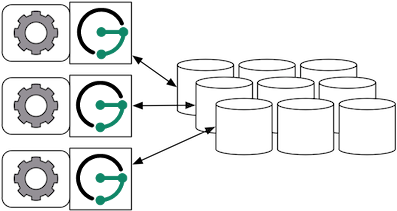

# Apache HBase


> Apache HBase is an open-source, distributed, versioned, non-relational
> database modeled after [Google’s Bigtable: A Distributed Storage
> System for Structured Data by Chang et
> al.](https://static.googleusercontent.com/media/research.google.com/en/us/archive/bigtable-osdi06.pdf)
> Just as Bigtable leverages the distributed data storage provided by
> the Google File System, Apache HBase provides Bigtable-like
> capabilities on top of Hadoop and HDFS.
>
> —  [Apache HBase Homepage](https://hbase.apache.org/)

## HBase Setup

The following sections outline the various ways in which JanusGraph can
be used in concert with Apache HBase.

### Local Server Mode


HBase can be run as a standalone database on the same local host as
JanusGraph and the end-user application. In this model, JanusGraph and
HBase communicate with one another via a `localhost` socket. Running
JanusGraph over HBase requires the following setup steps:

-   Download and extract a stable HBase from
    <https://www.apache.org/dyn/closer.cgi/hbase/stable/>.

-   Start HBase by invoking the `start-hbase.sh` script in the *bin*
    directory inside the extracted HBase directory. To stop HBase, use
    `stop-hbase.sh`.
```bash
$ ./bin/start-hbase.sh
starting master, logging to ../logs/hbase-master-machine-name.local.out
```

Now, you can create an HBase JanusGraph as follows:
```java
JanusGraph graph = JanusGraphFactory.build()
    .set("storage.backend", "hbase")
    .open();
```

Note, that you do not need to specify a hostname since a localhost
connection is attempted by default. Also, in the Gremlin Console, you
can not define the type of the variables `conf` and `g`. Therefore,
simply leave off the type declaration.

### Remote Server Mode



When the graph needs to scale beyond the confines of a single machine,
then HBase and JanusGraph are logically separated into different
machines. In this model, the HBase cluster maintains the graph
representation and any number of JanusGraph instances maintain
socket-based read/write access to the HBase cluster. The end-user
application can directly interact with JanusGraph within the same JVM as
JanusGraph.

For example, suppose we have a running HBase cluster with a ZooKeeper
quorum composed of three machines at IP address 77.77.77.77,
77.77.77.78, and 77.77.77.79, then connecting JanusGraph with the
cluster is accomplished as follows:
```java
JanusGraph g = JanusGraphFactory.build()
    .set("storage.backend", "hbase")
    .set("storage.hostname", "77.77.77.77, 77.77.77.78, 77.77.77.79")
    .open();
```

`storage.hostname` accepts a comma separated list of IP addresses and
hostname for any subset of machines in the HBase cluster JanusGraph
should connect to. Also, in the Gremlin Console, you can not define the
type of the variables `conf` and `g`. Therefore, simply leave off the
type declaration.

### Remote Server Mode with Gremlin Server


Finally, Gremlin Server can be wrapped around each JanusGraph instance
defined in the previous subsection. In this way, the end-user
application need not be a Java-based application as it can communicate
with Gremlin Server as a client. This type of deployment is great for
polyglot architectures where various components written in different
languages need to reference and compute on the graph.

    http://gremlin-server.janusgraph.machine1/mygraph/vertices/1
    http://gremlin-server.janusgraph.machine2/mygraph/tp/gremlin?script=g.v(1).out('follows').out('created')

In this case, each Gremlin Server would be configured to connect to the
HBase cluster. The following shows the graph specific fragment of the
Gremlin Server configuration. Refer to [JanusGraph Server](../operations/server.md) for a complete
example and more information on how to configure the server.

```yaml
...
graphs: {
  g: conf/janusgraph-hbase.properties
}
scriptEngines: {
  gremlin-groovy: {
    plugins: { org.janusgraph.graphdb.tinkerpop.plugin.JanusGraphGremlinPlugin: {},
               org.apache.tinkerpop.gremlin.server.jsr223.GremlinServerGremlinPlugin: {},
               org.apache.tinkerpop.gremlin.tinkergraph.jsr223.TinkerGraphGremlinPlugin: {},
               org.apache.tinkerpop.gremlin.jsr223.ImportGremlinPlugin: {classImports: [java.lang.Math], methodImports: [java.lang.Math#*]},
               org.apache.tinkerpop.gremlin.jsr223.ScriptFileGremlinPlugin: {files: [scripts/empty-sample.groovy]}}}}
...
```

## HBase Specific Configuration

Refer to [Configuration Reference](../configs/configuration-reference.md) for a complete listing of all HBase specific
configuration options in addition to the general JanusGraph
configuration options.

When configuring HBase it is recommended to consider the following HBase
specific configuration options:

-   **storage.hbase.table**: Name of the HBase table in which to store
    the JanusGraph graph. Allows multiple JanusGraph graphs to co-exist
    in the same HBase cluster.

Please refer to the [HBase configuration
documentation](https://hbase.apache.org/book/config.files.html) for more
HBase configuration options and their description. By prefixing the
respective HBase configuration option with `storage.hbase.ext` in the
JanusGraph configuration it will be passed on to HBase at initialization
time. For example, to use the znode /hbase-secure for HBase, set the
property: `storage.hbase.ext.zookeeper.znode.parent=/hbase-secure`. The
prefix allows arbitrary HBase configuration options to be configured
through JanusGraph.

!!! important
    HBase backend uses millisecond for timestamps. In JanusGraph 0.2.0 and
    earlier, if the `graph.timestamps` property is not explicitly set, the
    default is `MICRO`. In this case, the `graph.timestamps` property must
    be explicitly set to `MILLI`. Do not set the `graph.timestamps`
    property to another value in any cases.

## Global Graph Operations

JanusGraph over HBase supports global vertex and edge iteration.
However, note that all these vertices and/or edges will be loaded into
memory which can cause `OutOfMemoryException`. Use [JanusGraph with TinkerPop’s Hadoop-Gremlin](../advanced-topics/hadoop.md) to
iterate over all vertices or edges in large graphs effectively.

## Tips and Tricks for Managing an HBase Cluster

The [HBase shell](https://hbase.apache.org/book.html#shell) on the
master server can be used to get an overall status check of the cluster.
```bash
$HBASE_HOME/bin/hbase shell
```

From the shell, the following commands are generally useful for
understanding the status of the cluster.

```bash
status 'janusgraph'
status 'simple'
status 'detailed'
```

The above commands can identify if a region server has gone down. If so,
it is possible to `ssh` into the failed region server machines and do
the following:

```bash
sudo -u hadoop $HBASE_HOME/bin/hbase-daemon.sh stop regionserver
sudo -u hadoop $HBASE_HOME/bin/hbase-daemon.sh start regionserver
```

The use of [pssh](https://code.google.com/p/parallel-ssh/) can make this
process easy as there is no need to log into each machine individually
to run the commands. Put the IP addresses of the regionservers into a
`hosts.txt` file and then execute the following.

```bash
pssh -h host.txt sudo -u hadoop $HBASE_HOME/bin/hbase-daemon.sh stop regionserver
pssh -h host.txt sudo -u hadoop $HBASE_HOME/bin/hbase-daemon.sh start regionserver
```

Next, sometimes you need to restart the master server (e.g. connection
refused exceptions). To do so, on the master execute the following:

```bash
sudo -u hadoop $HBASE_HOME/bin/hbase-daemon.sh stop master
sudo -u hadoop $HBASE_HOME/bin/hbase-daemon.sh start master
```

Finally, if an HBase cluster has already been deployed and more memory
is required of the master or region servers, simply edit the
`$HBASE_HOME/conf/hbase-env.sh` files on the respective machines with
requisite `-Xmx -Xms` parameters. Once edited, stop/start the master
and/or region servers as described previous.
