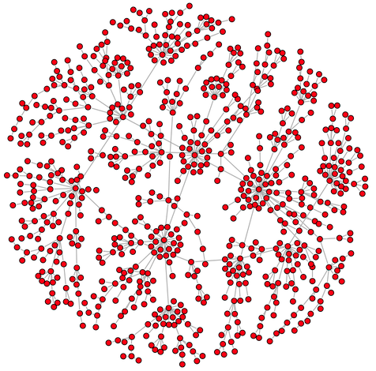

# Generating Artificial Natural Graphs



Real-world graphs are not [random](http://en.wikipedia.org/wiki/Random_graph). Example real-world graphs include social graphs, word graphs, neural graphs, airline graphs, water flow graphs, etc. Interestingly enough, there is a simple statistical understanding of most natural graphs. In short, many vertices have few connections and very few vertices have many connections. A popular algorithm to generate a graph that has this connectivity pattern is known as the [preferential attachment](http://en.wikipedia.org/wiki/Preferential_attachment) algorithm which can be simply described with the colloquial phrase: "the rich get richer." This section provides some simple code to artificially generate a natural looking graph in JanusGraph using [Gremlin](http://tinkerpop.apache.org/).

## Generating a Graph with Natural Statistics

The first thing to do is to connect to a Cassandra cluster with JanusGraph. In the example below, a local connection is used where `storage.batch-loading` ensures more speedy performance.

```groovy
conf = new BaseConfiguration()
conf.setProperty('storage.backend', 'cassandra')
conf.setProperty('storage.hostname', '127.0.0.1')
conf.setProperty('storage.batch-loading', 'true')
graph = JanusGraphFactory.open(conf)
g = graph.traversal()
```

Next, the following script generates a graph with `size` number of edges.

```groovy
mgmt = graph.openManagement()
follow = mgmt.makeEdgeLabel('linked').multiplicity(MULTI).make()
mgmt.commit()
size = 100000; ids = [g.addVertex().id()]; rand = new Random()
(1..size).each {
  v = graph.addVertex()
  u = g.V(ids.get(rand.nextInt(ids.size()))).next()
  v.addEdge('linked', u)
  ids.add(u.id())
  ids.add(v.id())
  if (it % 1000 == 0) 
    graph.tx().commit()
```
}

## Computing the In-Degree Distribution of the Graph

```groovy
g.V().local(inE().count()).groupCount().order(local).by(valueDecr)
```
